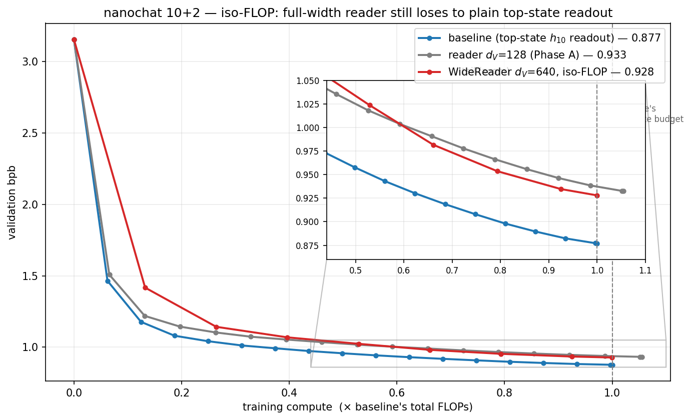

# 2D Transformers — a depth-axis "vertical reader"

Research code for the **vertical reader**: a small bidirectional transformer that reads over the
**depth (layer) axis** of a language model and *owns the output readout*, instead of predicting from
only the top layer's hidden state. The question:

> Does reading the whole depth **ladder** `[x0, h_1, …, h_L]` beat reading just the top rung `h_L`,
> at near-zero added cost?

The repo **vendors [karpathy/nanochat](https://github.com/karpathy/nanochat)** (MIT, commit
`dc54a1a`) as the transformer backbone and adds a pluggable depth-reader plus the experiments around
it. nanochat is otherwise unmodified except for **three small, gated edits** (listed below); with
`--reader=none` the training path is byte-identical to stock nanochat, so the baseline is a faithful
control.

## Result so far — depth-10 backbone (`d=640`, 10 layers, 5 heads)

The **"10+2"** setup: a stock nanochat depth-10 backbone **H** produces the 11-rung residual ladder
`[x0, h_1, …, h_10]`; a 2-layer bidirectional **reader V** over those rungs produces the readout —
no `h_10` skip, no gate, no identity init, so V has to *earn* its keep.

| readout | val bpb | training compute | Δ vs baseline |
|---|---|---|---|
| **baseline** — stock top-state `h_10` | **0.877** | 1.00× | — |
| reader `d_V=128` (bottlenecked) | 0.933 | 1.06× | +0.056 |
| reader `d_V=640` (full width, iso-FLOP) | 0.928 | 1.00× | +0.051 |

**Verdict: depth-reading-as-readout does not beat plain top-state reading at equal compute, and
widening the reader to full width (removing the 128-dim bottleneck) does not rescue it** — so the
bottleneck was not the cause. Full writeup, probes, and figures:
[`experiments/nanochat_10p2_reader.md`](experiments/nanochat_10p2_reader.md).



## Repository layout

| path | owner | what |
|---|---|---|
| `nanochat/` | vendored | nanochat backbone (MIT, Karpathy). Upstream docs: [`nanochat/README.md`](nanochat/README.md). |
| `nanochat/readers/` | **ours** | the depth-reader plugin — `base.py` (interface), `vertical.py` (`d_V=128`), `wide.py` (`d_V=640`), registry in `__init__.py`. |
| `nanochat/gpt.py`, `nanochat/optim.py` | vendored **+ our edits** | three surgical edits (below). |
| `scripts/` | mixed | nanochat entrypoints (`base_train.py` **+ our reader CLI**, `base_eval.py`, `tok_*`, `chat_*`) **and** our experiment scripts (below). |
| `experiments/` | **ours** | writeups, figures (`figs/`), and data (CSV/JSON). |
| `dev/`, `tasks/`, `tests/`, `pyproject.toml`, `uv.lock` | vendored | nanochat. |

The reader is a **plugin into nanochat's reader extension point**: `gpt.py` does
`from nanochat.readers import build_reader`, so adding an architecture is one module + one registry
line and needs no other backbone changes.

### Our edits to nanochat core (all gated — baseline stays stock nanochat)
- **`nanochat/gpt.py`** (+51 lines): when `config.reader != 'none'`, stash the per-block ladder and
  let the reader own the readout; otherwise the stock top-state path runs unchanged. Plus reader
  param-counting and Muon/AdamW optimizer wiring.
- **`nanochat/optim.py`** (+16 lines): two `world_size > 1` reader-optimizer fixes and a
  `torch._dynamo` recompile-limit bump for the reader's extra weight shapes.
- **`scripts/base_train.py`**: the `--reader / --reader-dim / --reader-layers / --reader-heads /
  --reader-mlp-mult` CLI, threaded into `GPTConfig`.

### Our experiment scripts (in `scripts/`)
| script | purpose |
|---|---|
| `run_phase_a.sh` | train d10 baseline vs `d_V=128` reader at the full budget |
| `run_wide640.sh` | train the `d_V=640` WideReader at iso-total-FLOP (756 steps) |
| `setup_data.sh` | download data shards + train the tokenizer |
| `inspect_reader.py` | depth-attention diagnostic (per-rung query-pool weights) |
| `svd_readout_probe.py` | PCA-truncation rank probe of the baseline readout |
| `frozen_probe.py` | trained 128-dim linear cap on the *frozen* baseline readout |
| `check_reader.py` · `check_reader_dist.py` · `check_wide_reader.py` | data-free integration / distributed / shape checks |
| `plot_phase_a.py` · `plot_wide_compare.py` | figures |

## Setup & reproduce

Uses nanochat's toolchain (uv + Rust for the tokenizer). On a CUDA box:
```bash
uv sync
bash scripts/setup_data.sh                              # data shards + tokenizer
CUDA_VISIBLE_DEVICES=2,3 NPROC=2 bash scripts/run_phase_a.sh   # baseline vs d_V=128 reader
CUDA_VISIBLE_DEVICES=2,3 NPROC=2 bash scripts/run_wide640.sh   # d_V=640 WideReader, iso-FLOP
```
Exact flags, the rank/frozen probes, and checkpoint paths are in
[`experiments/nanochat_10p2_reader.md`](experiments/nanochat_10p2_reader.md). Runs were on 2–4×
A100-40GB; `--window-pattern=L` (full-context attention) is used because A100 has no FA3 kernel.

## Credits & license

Backbone: [karpathy/nanochat](https://github.com/karpathy/nanochat) @ `dc54a1a`, MIT © Andrej
Karpathy (see [`LICENSE`](LICENSE)). Our additions are released under the same MIT license.
